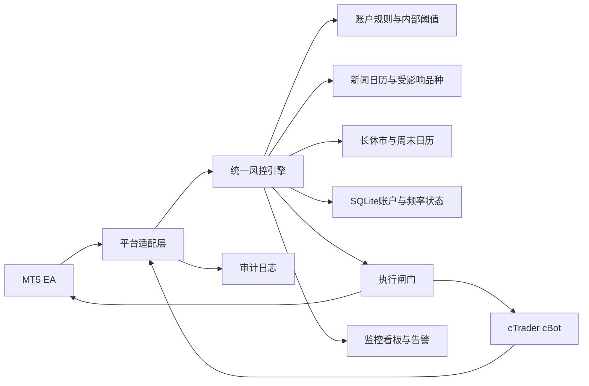

# 风控系统架构

## 1. 总体链路



## 2. 检查顺序

每一笔开仓、平仓或修改请求按以下顺序检查：

1. 账户状态：账户是否已经触及官方日亏或最大亏损底线。
2. 内部状态：是否达到 `RED` 或 `LOCKED`。
3. 新闻状态：当前品种是否处于 FTMO 硬限制窗口或公司预防窗口。
4. 市场状态：是否接近周末或超过 2 小时的休市。
5. 交易动作：是否为开仓、平仓、修改止损、取消挂单。
6. 止损约束：开仓必须有有效止损，且止损距离符合平台最小距离。
7. 频率约束：短周期、小时、日内开仓和服务器请求是否超限。
8. 风险额度：交易的预计止损损失是否超过当前剩余风险预算。
9. 审计：记录输入快照、规则版本、决定、原因和平台返回值。

检查应默认失败关闭：风控服务不可用、新闻或市场日历过期、账户状态无法读取时，不允许新增风险。

## 3. 状态机

```text
GREEN
  | 日亏或最大亏损使用率 >= 50%
  v
AMBER
  | 使用率 >= 70%
  v
RED
  | 使用率 >= 80% 或数据异常
  v
LOCKED
  | 官方底线被触及
  v
BREACH
```

`RED`、`LOCKED` 和 `BREACH` 禁止新增风险，但仍允许不在新闻硬窗口内的减仓、平仓和撤单。AMBER 的单笔预算减半。观察到 `LOCKED` 后会在 SQLite 中保持到下一个 Prague 交易日，即使权益随后反弹也不会恢复交易；观察到官方 `BREACH` 后永久保持，必须人工复核账户状态。

## 4. 规则计算

### 4.1 日亏

```text
daily_loss = max(0, day_start_balance - current_equity)
daily_limit = day_start_balance - initial_capital * official_daily_loss_pct
daily_utilization = daily_loss / (initial_capital * official_daily_loss_pct)
```

必须同时保存：

- 当前权益；
- 当日最低权益；
- 日界线开始余额；
- 当日已平仓损益；
- 当日浮动损益；
- 佣金和隔夜利息。

### 4.2 最大亏损

2-Step 使用静态底线：

```text
max_loss_limit = initial_capital * (1 - official_max_loss_pct)
```

1-Step 使用结算余额追踪模型：

```text
max_loss_limit =
    highest_settled_balance - initial_capital * official_max_loss_pct
```

`highest_settled_balance` 只能在 FTMO 日界线结算后更新，不能使用盘中浮动权益抬高底线。

### 4.3 以损定仓

平台适配层先把入场价、止损价、品种合约规格转换为“每一单位交易量的止损货币损失”：

```text
loss_per_volume_unit =
    abs(entry - stop_loss) / tick_size * tick_value
```

实际系统应使用平台原生的利润/风险计算函数处理货币转换、合约大小、佣金和点值。

已有持仓必须按当前可平仓报价到止损的剩余权益风险计算，不能继续使用入场价；否则盈利仓位回撤到止损时会低估权益下降。挂单尚未进入权益，因此仍按目标入场价到止损计算。现有开放风险会先从日亏缓冲和最大亏损缓冲扣除，再计算下一笔交易预算。

```text
position_size =
    floor(risk_budget / loss_per_volume_unit / volume_step) * volume_step
```

交易量必须向下取整，且小于最小交易量时拒绝。

## 5. 新闻策略

新闻事件至少包含：

```text
event_id
release_time_utc
importance
affected_symbols
source
rule_version
```

内部预防窗口默认是新闻前后 10 分钟：

- 禁止增加受影响品种风险；
- 取消挂单；
- 禁止新开仓；
- 在 FTMO 硬窗口前主动平仓或减仓，避免止损或止盈在硬窗口内自动触发。

FTMO Standard FTMO Account 的硬窗口由账户规则配置决定，默认前后 2 分钟。Swing 账户和评估阶段不能直接套用同一条新闻规则，必须由账户配置决定。

新闻守护进程必须处理已有仓位，而不是只拦截新订单。对于 Standard FTMO Account：

```text
T - 10 分钟：取消受影响品种挂单，停止增加风险
T - 10 分钟至 T - 2 分钟：主动减仓或平仓
T - 2 分钟至 T + 2 分钟：禁止开仓、平仓以及让 SL/TP 触发
T + 10 分钟：检查点差和流动性后恢复交易
```

## 6. 平台适配约束

### MT5 EA

建议每个账户安装一个 `RiskGuardEA`，策略 EA 通过唯一 `Magic Number` 和 `Idea ID` 标记交易。适配层需要采集：

- `ACCOUNT_BALANCE`、`ACCOUNT_EQUITY`；
- 当前持仓和挂单；
- 历史订单、成交、佣金、Swap；
- `OnTradeTransaction` 交易事件；
- 订单请求与平台返回码。

同一笔交易可能触发多个交易事件，必须使用订单号、成交号和请求 ID 去重。

### cTrader cBot

建议使用统一的 `RiskGuard` cBot 或交易插件。适配层需要采集：

- `Account.Balance`、`Account.Equity`；
- `Positions`、`PendingOrders` 和历史交易；
- 开仓、平仓、修改事件；
- `Label`、策略 ID 和交易思想 ID；
- 平台交易结果和错误码。

平台的交易量单位可能不同，适配层必须先归一化到统一风险单位，再交给核心引擎。

## 7. 周末与长休市

对持续至少 2 小时的休市：

```text
T - 120 分钟：所有阶段禁止新增风险，防止 gap trading
T - 10 分钟：Standard FTMO Account 平仓并取消挂单
T：若仍有 Standard 持仓，触发紧急告警
```

Evaluation 和 Swing 可以跨周末持仓，但仍受禁止 gap trading 的前 2 小时开仓限制。

## 8. 持久化

平台每次评估前调用 `/v1/account-sync`。SQLite 保存：

- Prague 日界线和当日开始余额；
- 1-Step 最高结算余额；
- 最近请求、开仓和修改时间；
- 风控允许后的开仓频率预留；
- 平台明确拒绝后释放的预留。
- 当日内部锁和已观察到的官方违规锁。

重启 EA/cBot 或 API 不会清空频率。

Prague 日界线以风控服务器接收账户同步的时间为准。客户端 `as_of` 只用于时钟偏差和快照新鲜度检查；若评估时数据库仍停留在上一 FTMO 日，新增风险会因结算基线不确定而被拒绝。

平台请求 ID 也必须跨重启保持唯一：MT5 使用账户级持久序号与 UTC 秒，cTrader 使用 GUID。服务端仍以 `(account_id, request_id)` 作为幂等边界。

## 9. 断线和异常

以下情况必须停止新增风险：

- 账户权益超过 5 秒未更新；
- 新闻日历超过 60 秒未同步；
- 长休市日历超过 1 小时未同步；
- 日界线转换失败；
- 平台订单结果未知；
- 核心风控服务不可用；
- 规则版本不匹配。

恢复交易前必须完成状态重建：余额、权益、持仓、挂单、历史成交、当日最低权益和频率计数全部重新读取。
